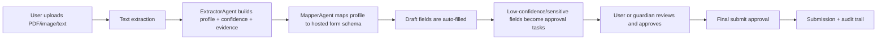

# FlôForm 

FlôForm is an autonomous AI form assistant designed to restore digital independence for people who struggle with complex online workflows.

## Elevator Pitch

Online forms are one of the biggest hidden barriers to independence.

FlôForm is an autonomous AI agent that completes entire multi-step, multi-page workflows on behalf of the user, securely, accurately, and independently.

It navigates complex digital systems, fills in required fields, handles validations, and submits forms with built-in guardian-friendly approval gates for safety.

We are not simplifying paperwork.
We are restoring digital autonomy.

## Why We Built This

This idea came from people in our own lives.

Have you ever started signing up for something, then backed away because the process was too long and exhausting?

That same friction can become a hard barrier for many people:

- One team member's grandmother has Parkinson's disease and faces serious barriers with online forms. Tremors can cause typos, and memory challenges can make complex flows risky and dependent on outside help.
- Another team member regularly works with neurodivergent individuals who experience overstimulation during long digital workflows.

FlôForm exists to close that gap. Overwhelm, overstimulation, or physical barriers should not stop someone from booking a doctor's appointment, applying for aid, or completing essential life tasks.

## What This Repository Implements Today

This repository currently ships an MVP workflow focused on a hosted scholarship application demo.

- Secure sign-in with Clerk
- Document ingestion (PDF, image, pasted text)
- Text extraction (PDF parser + optional OCR)
- Structured profile extraction with confidence and evidence
- Mapping extracted data into a stable multi-step form schema
- Auto-fill draft creation and review workflow
- Approval gating for low-confidence or sensitive fields
- Final submission gate requiring explicit approval
- Append-only audit events and run-state snapshots
- Trace viewer for resumable interrupted runs
- Accessibility toggles (low cognitive load, high contrast, large text)

## How It Works



## Safety Model

FlôForm is intentionally supervised, not "fire-and-forget" automation.

- Nothing can be finalized without a `final_submit` approval task marked approved.
- Any field below the confidence threshold (`0.75`) is gated for approval.
- Sensitive fields are always gated regardless of confidence.
- Every extracted or mapped field carries evidence and confidence metadata.
- Input guardrail blocks likely secrets in uploaded text.
- Output guardrail blocks unverified claims of successful submission.
- All key actions are logged in audit events.
- Run state is snapshotted to support interruption visibility and resumable flows.

Note: in this MVP, approvals are resolved by the authenticated account. That account can represent the user directly or an assisting family guardian in supervised use.

## Product Surfaces

### Routes

Public route:

- `/`

Protected application routes:

- `/app`
- `/app/new`
- `/app/applications/:id/run`
- `/app/applications/:id/profile`
- `/app/applications/:id/review`
- `/app/forms/scholarship/:id`
- `/app/applications/:id/submitted`
- `/app/trace-viewer`

### API Endpoints

- `POST /api/applications` create a new application
- `POST /api/upload` upload document to Convex storage and persist metadata
- `POST /api/extract-text` extract text from PDFs
- `POST /api/documents/attach-text` attach extracted text to a saved document
- `POST /api/documents/text` save pasted text as a document
- `POST /api/agent/run` start or resume the autonomous workflow (SSE streaming)
- `POST /api/profile/update` persist profile edits
- `POST /api/review/apply` apply mapping values to draft fields
- `POST /api/draft/set` set one draft field value
- `GET /api/approvals/list?applicationId=...` list approval tasks
- `POST /api/approvals/resolve` approve or reject a task
- `POST /api/submit/request-final` create final submission approval task
- `POST /api/submit/finalize` finalize submission if final approval exists

## Tech Stack

Locked stack in this repository:

- Node.js `>=22`
- `pnpm`
- Next.js `16.1.6` + React `19.2.4` + TypeScript `5.9.3`
- Tailwind CSS `4.2.0` + shadcn-style UI components + lucide-react
- Clerk (`@clerk/nextjs`)
- Convex (`convex`)
- OpenAI Agents SDK JS (`@openai/agents`) + Zod
- GitHub Models endpoint via OpenAI-compatible client

### Submission Answer

**What languages, frameworks, platforms, cloud services, databases, APIs, or other technologies did you use?**

We built FlôForm with TypeScript (and JavaScript in generated/runtime parts) on Node.js, using Next.js + React for the web app and Tailwind CSS for UI styling. Authentication is handled by Clerk, backend/data functions are built on Convex (including its database), and the AI workflow uses the OpenAI Agents SDK with Zod-validated tools/schemas. For model access, we use the GitHub Models API through an OpenAI-compatible client; document parsing uses `pdf-parse` with optional OCR via `tesseract.js`.

## Agents SDK Notes

The agent runtime aligns to the local SDK documentation artifact:

- `AGENT_SDK_DOCUMENTATION.pdf`

Implemented patterns include:

- `tool(...)` with Zod schemas and `needsApproval`
- Streaming `run(..., { stream: true })`
- Human-in-the-loop interruptions and resumable run snapshots
- Memory session usage
- Custom OpenAI-compatible client setup
- `setOpenAIAPI("chat_completions")`
- Tracing toggles with fallback behavior

## Data Model (Convex)

Core tables:

- `users`
- `applications`
- `documents`
- `profiles`
- `formSchemas`
- `fieldMappings`
- `fillDrafts`
- `approvalTasks`
- `runStateSnapshots`
- `auditEvents`

Schema lives in `convex/schema.ts` and business logic lives in `convex/klerki.ts`.

## Local Setup

### 1. Install dependencies

```bash
pnpm install
```

### 2. Configure environment

```bash
cp .env.example .env.local
```

Set values in `.env.local`.

### 3. Configure Clerk + Convex auth

- Create Clerk keys and set `NEXT_PUBLIC_CLERK_PUBLISHABLE_KEY` and `CLERK_SECRET_KEY`.
- Set `CLERK_JWT_ISSUER_DOMAIN` (used by `convex/auth.config.ts`).
- Ensure your Clerk JWT template is named `convex` because server code requests `getToken({ template: "convex" })`.

### 4. Run Convex backend

```bash
pnpm convex:dev
```

### 5. Run Next.js app

In a second terminal:

```bash
pnpm dev
```

Open [http://localhost:3000](http://localhost:3000).

## Environment Variables

See `.env.example` for the full list.

Required for normal app behavior:

- `NEXT_PUBLIC_CLERK_PUBLISHABLE_KEY`
- `CLERK_SECRET_KEY`
- `CLERK_JWT_ISSUER_DOMAIN`
- `CONVEX_URL`
- `NEXT_PUBLIC_CONVEX_URL`
- `GITHUB_TOKEN` or `GITHUB_MODELS_API_KEY`

Common optional toggles:

- `GITHUB_MODELS_BASE_URL` (defaults to GitHub Models endpoint)
- `GITHUB_MODELS_AGENT_MODEL` (default `gpt-4o-mini`)
- `ENABLE_TRACING` (`true` or `false`)
- `OPENAI_TRACING_API_KEY`
- `ENABLE_OCR` (`true` or `false`)

## Scripts

- `pnpm dev` start Next.js dev server
- `pnpm build` build production bundle
- `pnpm start` run production server
- `pnpm lint` run ESLint
- `pnpm convex:dev` run Convex local/dev sync
- `pnpm convex:deploy` deploy Convex functions
- `pnpm test` run unit tests
- `pnpm test:watch` run tests in watch mode

## Demo Flow

1. Sign in and start a new application.
2. Upload resume PDF and optional ID image, or paste fallback text.
3. Run extraction and watch live workflow events.
4. Review extracted profile fields with confidence and evidence.
5. Review mapping plan and flagged fields.
6. Approve flagged items and apply fill.
7. Open hosted form and review auto-filled fields.
8. Request final approval, approve, then submit.
9. Open submission summary and download JSON.

## Testing

Run:

```bash
pnpm test
```

Current unit tests cover:

- Schema validation constraints
- Approval gating logic

## Current MVP Scope and Limitations

- The hosted workflow is currently centered on one stable scholarship form schema.
- Profile extraction and field mapping include deterministic heuristic fallbacks.
- Guardian-specific identity and delegation policies are not fully productized yet; approvals are task-based and tied to authenticated users.
- OCR quality depends on image quality and language support.

## Project Structure

- `app/` Next.js app routes and API routes
- `components/` UI and workflow features
- `lib/` shared runtime logic, schemas, and agent orchestration
- `convex/` Convex schema and server functions
- `tests/` unit tests
- `DEMO.md` live demo script

## License

Licensed under MIT. See `LICENSE`.
